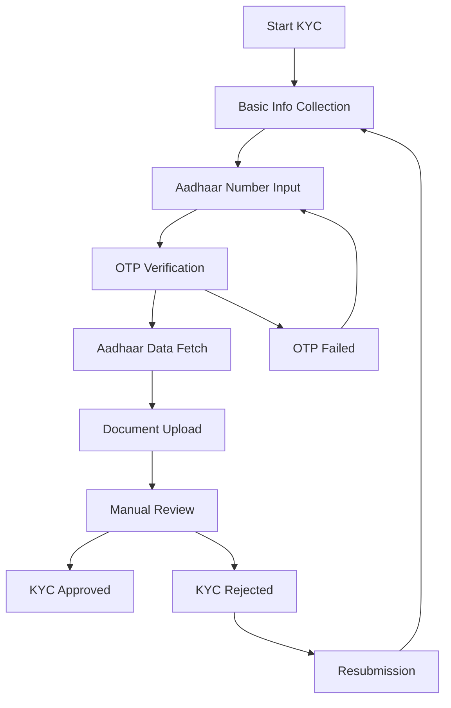

# Implementing Secure KYC with Aadhaar Verification in Flutter

One of the most critical features in Anudha Mart is the KYC (Know Your Customer) verification system with Aadhaar integration. This post details our implementation approach, security considerations, and lessons learned.

<!-- truncate -->

## The Importance of KYC in E-commerce

In the Indian e-commerce landscape, KYC verification is not just a regulatory requirement—it's essential for:

- **Trust Building**: Verified vendors increase customer confidence
- **Compliance**: Meeting RBI and government regulations
- **Fraud Prevention**: Reducing fake accounts and fraudulent activities
- **Business Intelligence**: Understanding your vendor ecosystem

## Our KYC Implementation Strategy

### Multi-Step Verification Process



### Technical Implementation

#### 1. Aadhaar Integration

```dart
class AadhaarVerificationBloc extends Bloc<AadhaarEvent, AadhaarState> {
  final AadhaarService _aadhaarService;
  
  AadhaarVerificationBloc({required AadhaarService aadhaarService})
      : _aadhaarService = aadhaarService,
        super(AadhaarInitial());

  @override
  Stream<AadhaarState> mapEventToState(AadhaarEvent event) async* {
    if (event is SendOtpEvent) {
      yield* _mapSendOtpToState(event);
    } else if (event is VerifyOtpEvent) {
      yield* _mapVerifyOtpToState(event);
    }
  }

  Stream<AadhaarState> _mapSendOtpToState(SendOtpEvent event) async* {
    yield AadhaarLoading();
    try {
      final response = await _aadhaarService.sendOtp(event.aadhaarNumber);
      yield OtpSent(transactionId: response.transactionId);
    } catch (error) {
      yield AadhaarError(message: error.toString());
    }
  }
}
```

#### 2. Secure Data Handling

```dart
class SecureAadhaarService {
  final EncryptionService _encryption;
  final ApiService _apiService;

  Future<AadhaarResponse> verifyOtp({
    required String otp,
    required String transactionId,
  }) async {
    // Encrypt sensitive data before transmission
    final encryptedOtp = await _encryption.encryptAES(otp);
    
    final response = await _apiService.post(
      '/kyc/verify-aadhaar-otp',
      data: {
        'otp': encryptedOtp,
        'transactionId': transactionId,
        'timestamp': DateTime.now().millisecondsSinceEpoch,
      },
    );

    // Decrypt response data
    final decryptedData = await _encryption.decryptAES(response.data);
    return AadhaarResponse.fromJson(decryptedData);
  }
}
```

### Security Measures

#### 1. Data Encryption
- **AES-256 encryption** for all Aadhaar data in transit
- **RSA encryption** for API key exchange
- **Hashing** for sensitive data storage

#### 2. Secure Storage
```dart
class SecureStorage {
  static const _storage = FlutterSecureStorage(
    aOptions: AndroidOptions(
      encryptedSharedPreferences: true,
    ),
    iOptions: IOSOptions(
      groupId: 'com.anudhmart.keychain',
      accountName: 'AnudhaKeychain',
    ),
  );

  Future<void> storeAadhaarHash(String aadhaarNumber) async {
    final hashedAadhaar = await _hashAadhaar(aadhaarNumber);
    await _storage.write(key: 'aadhaar_hash', value: hashedAadhaar);
  }
}
```

#### 3. API Security
- **Certificate pinning** for HTTPS connections
- **JWT tokens** with short expiration times
- **Rate limiting** to prevent abuse
- **API key rotation** every 24 hours

## Auto-Population Features

### Smart Form Filling

```dart
class KycAutoPopulationService {
  Future<void> populateFromAadhaar(AadhaarData aadhaarData) async {
    final kycForm = KycFormData(
      fullName: aadhaarData.name,
      dateOfBirth: aadhaarData.dateOfBirth,
      gender: aadhaarData.gender,
      address: Address(
        street: aadhaarData.address.careOf,
        city: aadhaarData.address.district,
        state: aadhaarData.address.state,
        pincode: aadhaarData.address.pincode,
        country: aadhaarData.address.country,
      ),
    );

    // Auto-save populated data
    await _kycRepository.savePartialKycData(kycForm);
    
    // Notify UI to update form fields
    _kycBloc.add(KycDataPopulated(kycForm));
  }
}
```

### Auto-Save Functionality

```dart
class KycAutoSaveService {
  Timer? _autoSaveTimer;
  
  void startAutoSave() {
    _autoSaveTimer = Timer.periodic(
      Duration(seconds: 30),
      (_) => _saveFormData(),
    );
  }

  Future<void> _saveFormData() async {
    final currentFormData = _formController.getCurrentData();
    if (currentFormData.hasChanges) {
      await _kycRepository.savePartialKycData(currentFormData);
      _showAutoSaveIndicator();
    }
  }
}
```

## Performance Optimizations

### 1. Lazy Loading
- Load KYC sections only when needed
- Implement pagination for document lists
- Use image compression for document uploads

### 2. Caching Strategy
```dart
class KycCacheManager {
  static const _cacheValidityHours = 24;
  
  Future<KycData?> getCachedKycData(String userId) async {
    final cached = await _cache.get('kyc_$userId');
    if (cached != null && !_isCacheExpired(cached.timestamp)) {
      return KycData.fromJson(cached.data);
    }
    return null;
  }
}
```

## Testing Strategy

### Unit Tests
```dart
group('AadhaarVerificationBloc', () {
  late AadhaarVerificationBloc bloc;
  late MockAadhaarService mockService;

  setUp(() {
    mockService = MockAadhaarService();
    bloc = AadhaarVerificationBloc(aadhaarService: mockService);
  });

  test('should emit OtpSent when OTP is sent successfully', () async {
    // Arrange
    when(mockService.sendOtp(any))
        .thenAnswer((_) async => OtpResponse(transactionId: 'test123'));

    // Act
    bloc.add(SendOtpEvent(aadhaarNumber: '123456789012'));

    // Assert
    await expectLater(
      bloc.stream,
      emitsInOrder([
        AadhaarLoading(),
        OtpSent(transactionId: 'test123'),
      ]),
    );
  });
});
```

### Integration Tests
```dart
void main() {
  group('KYC Integration Tests', () {
    testWidgets('complete KYC flow', (WidgetTester tester) async {
      await tester.pumpWidget(MyApp());
      
      // Navigate to KYC screen
      await tester.tap(find.byKey(Key('start_kyc_button')));
      await tester.pumpAndSettle();
      
      // Enter Aadhaar number
      await tester.enterText(
        find.byKey(Key('aadhaar_input')),
        '123456789012',
      );
      
      // Verify OTP flow
      await tester.tap(find.byKey(Key('send_otp_button')));
      await tester.pumpAndSettle();
      
      expect(find.text('OTP sent successfully'), findsOneWidget);
    });
  });
}
```

## Challenges and Solutions

### Challenge 1: Aadhaar API Rate Limits
**Solution**: Implemented intelligent retry mechanism with exponential backoff

### Challenge 2: Network Connectivity Issues
**Solution**: Added offline capability with data sync when connection is restored

### Challenge 3: User Experience During Verification
**Solution**: Added progress indicators, clear error messages, and smooth transitions

## Compliance and Legal Considerations

### Data Privacy (PDPA Compliance)
- **Minimal data collection**: Only collect necessary KYC information
- **Data retention policies**: Automatic deletion after legal requirements are met
- **User consent**: Clear opt-in for data processing
- **Data portability**: Allow users to export their KYC data

### Security Audits
- Regular penetration testing
- Code security reviews
- Third-party security assessments
- Compliance with industry standards (ISO 27001)

## Future Enhancements

### Planned Features
- **Biometric verification** using device sensors
- **Video KYC** for enhanced verification
- **AI-powered document verification** 
- **Blockchain-based identity management**

### Technical Improvements
- **GraphQL** for more efficient API calls
- **WebRTC** for real-time video verification
- **Machine learning** for fraud detection
- **Microservices architecture** for better scalability

## Conclusion

Implementing secure KYC with Aadhaar verification in Flutter requires careful consideration of security, user experience, and compliance requirements. Our implementation balances these concerns while providing a smooth, secure experience for users.

The key lessons learned:
1. **Security first**: Never compromise on data protection
2. **User experience matters**: Make verification as smooth as possible
3. **Test thoroughly**: Both automated and manual testing are crucial
4. **Stay compliant**: Keep up with changing regulations
5. **Monitor continuously**: Real-time monitoring and alerting are essential

---

*For detailed implementation guides and code examples, check out our [KYC documentation](/docs/AADHAAR_VERIFICATION_IMPLEMENTATION) and [security best practices](/docs/AUTHENTICATION_REFACTORING_SUMMARY).*
